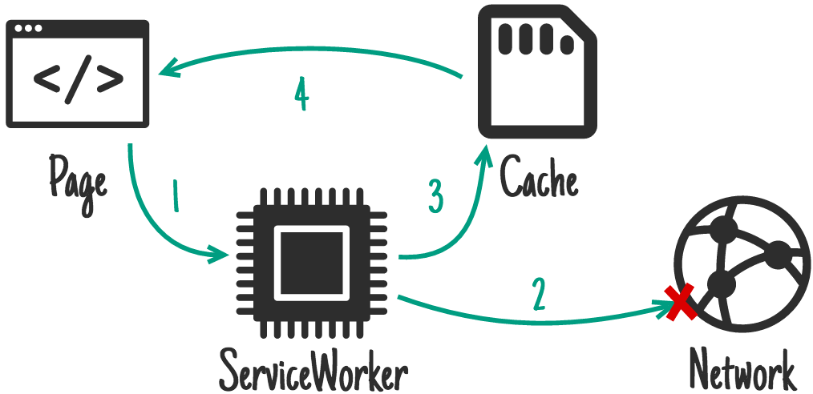

# PWA Workshop

<a href="https://twitter.com/GauteMeekOlsen" target="_blank" alt="Twitter"
  class="abs-br m-6 text-xl icon-btn opacity-50 !border-none !hover:text-white">
  <carbon-logo-twitter />
</a>

<style>
  h1 {
    font-size: 70px;
    color: black;
    font-weight: bold;
    transform: translateY(-190px);
    text-shadow: 2px 2px 2px #333;
  }
</style>

---
theme: default
class: flex flex-col text-center justify-center font-bold text-fuchsia-700
---

<p class="text-8xl bg">PWA</p>
<p class="text-6xl">=</p>
<p class="text-6xl">Progressive Web Apps</p>


---

# What you will learn

- What PWA is
- Why PWA is the answer to everything
- Why PWA is NOT the answer to everything
- How to transform a website to a PWA

---

# Website vs Mobile App

## Pro Website
- Discovered on Google
- Less development cost
- Deploy new versions fast

## Pro Mobile App
- Discovered on App Store
- Device capabilities
- Open from home screen
- Offline access
- Users spend more time on apps

---
layout: center
class: text-center
---

# Can PWA close the advantage gap for mobile apps?

---

# What is a PWA

A website that is installable, reliable, and capable.

---

# Installable

Installed apps are used more often.

<div class="flex justify-around">
  
  
  
</div>

---

# Reliable

Fast and dependable regardless of the network.

<div class="flex justify-around">
  <Offline/>
  <Loading/>
  <OfflineOk/>
</div>

PWA allowes you to cache files and data for performance and offline

---

# Capable

Using device features.

<iframe id="webcando" title="what web can do today" src="https://whatwebcando.today/"></iframe>

Good resources: [What Web Can do Today?](https://whatwebcando.today/), [Can I use](https://caniuse.com/)

<style>
  #webcando{
    width: 100%;
    height: 70%;
  }
</style>

---

# How to create a PWA = Lighthouse

<div style="overflow: auto; height: 400px;" class="scroll">
  
</div>

<style>
.scroll::-webkit-scrollbar-track
{
	-webkit-box-shadow: inset 0 0 6px rgba(0,0,0,0.3);
	background-color: #F5F5F511;
	border-radius: 10px;
}

.scroll::-webkit-scrollbar
{
	width: 10px;
	background-color: transparent;
}

.scroll::-webkit-scrollbar-thumb
{
	border-radius: 10px;
	background-image: -webkit-gradient(linear,
									   left bottom,
									   left top,
									   color-stop(0.44, rgb(122,153,217)),
									   color-stop(0.72, rgb(73,125,189)),
									   color-stop(0.86, rgb(28,58,148)));
}
</style>

---
layout: center
class: text-center
---

# App store

<div class="flex">
  <flat-ui-google class="text-8xl"/>
  <fluent-store-microsoft-20-regular class="text-8xl"/>
  <div style="position: relative;" v-click>
    <flat-ui-app-store class="text-8xl" style="position: absolute; inset: 0;"/>
    <ic-baseline-do-not-disturb-alt class="text-8xl" style="position: absolute; inset: 0; color: red;"/>
  </div>
</div>


---

# Why it's not ready

<div class="flex justify-evenly" style="align-items: center; margin-top: 100px;">
  <logos-safari v-click class="text-10xl"/>
  <div v-click class="flex flex-col justify-center">
    <ant-design-experiment-filled class="text-8xl"/>
    <p style="text-align: center">Experimental</p>
  </div>
</div>

---
layout: center
class: text-center
---

# Exercise

<div class="icon-container">
  
</div>
<h2>App Shake</h2>

<v-click>
  <a href="https://github.com/gautemo/app-shake-pwa-workshop" target="_blank">https://github.com/gautemo/app-shake-pwa-workshop</a>
</v-click>

<style>
  .icon-container{
    margin: 0 auto;
    border-radius: 50%;
    background: #D955B5;
    width: 300px;
    height: 300px;
    display: grid;
    place-items: center;
  }
</style>

---

# Exercise 1 - Installable

- Manifest
- Service worker
- HTTPS

<div v-click class="mt-8">
  Goal:
  <div class="flex justify-around">
    
    
  </div>
</div>

<div v-click class="mt-8">
  Exercise-1.md
</div>

---

# Exercise 2 - Cache files & offline mode

## Cache files

```js{2,10|4-6,12-15}
const cacheName = `cache-v1`;
self.addEventListener('install', function(event) {
  event.waitUntil(
    caches.open(cacheName).then(function(cache) {
      return cache.addAll(['main.js']);
    })
  );
});

self.addEventListener('fetch', function(event) {
  event.respondWith(
    caches.open(cacheName).then(function(cache) {
      return cache.match(event.request).then(function (response) {
        return response;
      });
    })
  );
});
```

---

# Cache strategies

<div class="flex flex-col justify-center content-center">
  <p class="text-center">Cache First</p>
  
</div>

---

# Cache strategies

<div class="flex flex-col justify-center content-center">
  <p class="text-center">Network First</p>
  
</div>

---

# Cache strategies

<div class="flex flex-col justify-center content-center">
  <p class="text-center">Stale-While-Revalidate</p>
  
</div>

---
layout: center
class: text-center
---

<file-icons-workbox class="text-6xl"/> 
<span>Workbox</span>

---

# Exercise 2 - Cache files & offline mode

## Offline mode

<div class="flex justify-center items-center">
  
  <mdi-arrow-right-bold-box class="text-8xl m-8"/>
  
</div>

---

# Exercise 3 - Promoting PWA installation

## Goal

<div class="flex justify-around">
  
  
  
</div>

---

# Exercise 4 - Capable

## Accelerometer
Let's play

## Push notifications
If you want, only for Chrome